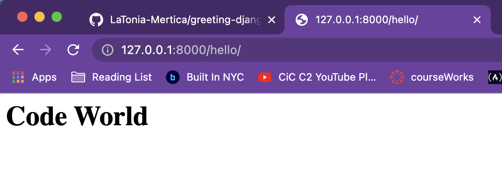
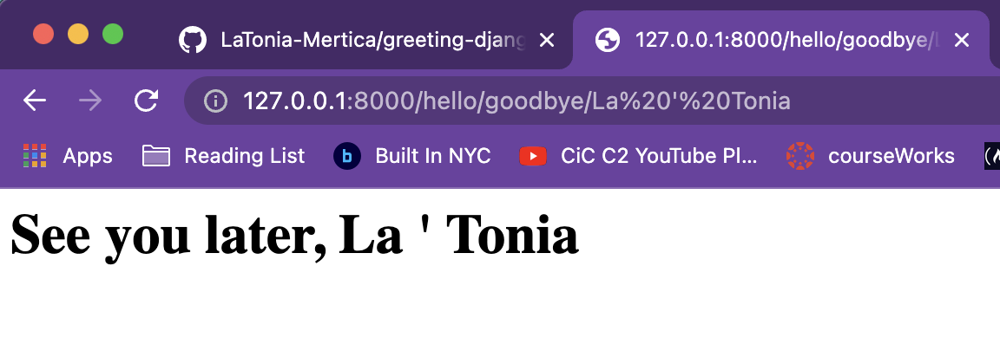

# GREETING
##### *basic django structure to greet - hello & goodbye - in code and in browser*
<br>
<br>

**HOW IT WORKS**
- run commands to start django app server
    - ```source django-env/bin/activate```
    - ```python manage.py runserver```
    - if errors try ```python3 manage.py runserver```
    <br>
    <br>
- go to django app endpoint in browser
    - ```http://127.0.0.1:8000/hello```
    - works with and w/o forward slash added at end
    <br>
    <br>
- enter forward slash followed by someone's name
    - ```http://127.0.0.1:8000/hello/namehere```
    <br>
    <br>
- see greeting rendered on webpage


<br>
<br>

- extend path to render goodbye greeting
    - ```http://127.0.0.1:8000/hello/goodbye/namehere```


<br>
<br>

**NEXT STEPS**
- usual code suspects:
    - scale greetings
    - style liberally
    - deploy/universal access
<br>
<br>
